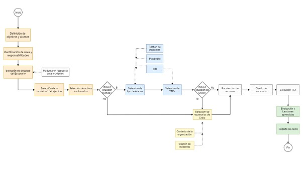
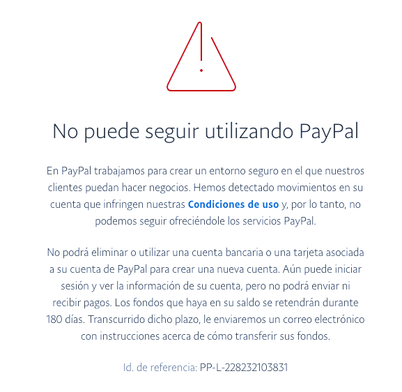

# Informe de caso página marketing
Informe forense: Ataque Robo de datos financieros
Autor: Joel Velarde
cargo: jefe ciberseguridad
fecha: 8/08/2024
hora: 3:00 pm

## 1.- Resumen ejecutivo
Este informe está basado en un incidente de seguridad que sucedió el día 8 de agosto a las 2 pm, en el que se notificó de una fuga de datos financieros sencibles de un usuario. Por fortuna, el usuario era el helping desk de la empresa y se percató rápidamente, cambiando los datos y evitando que el problema pase a mayores. Se realizó una investigación forense inmediata y se descubrió cómo el atacante logró robar esta información. Se identificaron las vulnerabilidades y se proponen soluciones para mitigar el riesgo y prevenir futuros ataques similares

## 2.- Metodología
Las metodologías utilizadas para descubrir esta fuga:
   
- Mediante un monitoreo de transacciones anomalas.
   
- Alertas de la API
   
- Análisis de logs del servidor
   
- Reporte de nuestro helping desk

## 3.- Hallazgos
1.- El Helping Desk descubrió sus datos siendo utilizados sin autorización, por lo que hizo el reporte.

2.- Nuestro cuerpo de ciberseguridad se percató de un aumento inusual en la cantidad de transacciones pequeñas y pagos fallidos.

3.- La API notifica solicitudes desde fuentes geográficas extrañas y anónimas.

4.- En los logs se encontró la misma actividad inusual que mostraban las alertas de la API, junto con intentos de acceso repetido.

5.- Durante la auditoria de seguridad se descubrió una vulnerabilidad importante en el sistema.

## 4.- Analisis
A partir de los datos y hallazgos inusuales, se revisó el código fuente que tenga que ver con pagos y más que nada con PayPal; se buscan más pruebas de logs que haga el ciberdelincuente; sabemos que está explotando una vulnerabilidad de la empresa, así que estamos monitorizando para encontrar su actividad. Analizando el código estático se encontraron varias cosas.

## 5.- Conclusiones
Según las evidencias y análisis del caso, se sabe casi con total certeza que la causa de fuga de los datos fue una mala estructuración de la API de pago en Paypal, un error de arquitectura de parte del desarrollador y también el equipo de seguridad. Una fuga de información tan sencible puede traer consecuencias catastróficas a la empresa (multas millonarias, quiebra, hasta pago con cárcel). Debemos reconsiderar y juzgar al equipo de seguridad. Tal vez se necesite hacer cambios, en cuanto a los desarrolladores, una estricta advertencia de su falta.

El problema será solucionado, siempre y cuando sea inmediato.

## 6.- Recomendaciones
1.- Revocar y regenerar las credenciales: se revocarán las credenciales comprometidas y se generarán nuevas, asegurándose que no se expongan de nuevo.

2.- Inavilitar el sistema de pagos con PayPal momentáneamente, para que el ciber delincuente no siga sacando datos sencibles.

3.- Notificar a los clientes de esta medida, más no de las razones; no se puede perder reputación.

4.- Almacenar las credenciales de la API (client ID, client Secret) en variedades de entorno backend y de manera segura.

5.- Auditoria de testeo de la API usando herramientas para asegurar su seguridad y volver a implementar el método de pago.

6.- Despedir a un responsable…

## 7.- Anexo.

